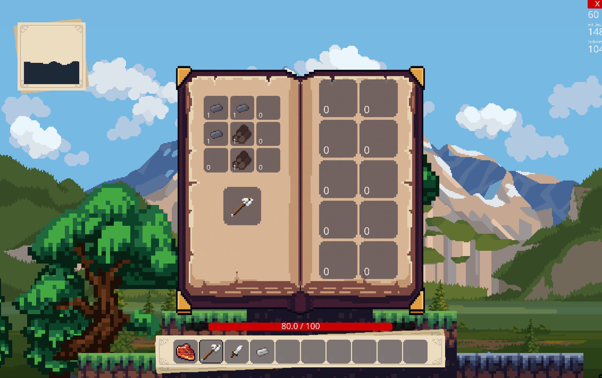

# Wanderer Game

Wanderer is an immersive survival game that places players in a procedurally generated world filled with diverse biomes and challenging environments. The primary objective is to survive in this harsh world by gathering resources, building bases, and defending against relentless monster attacks that occur every night. The game offers a rich exploration experience, allowing players to traverse through various landscapes, uncover hidden secrets, and collect rare materials. The procedural generation ensures that each playthrough is unique, providing endless replayability and new challenges with every game.

## Key Features

- **Exploration**: Discover a vast world with different biomes, each offering unique resources and challenges. Provided is a minimap that allows the player to see the close area around him.
- **Mining**: Extract valuable resources from the earth to craft tools, weapons, and build structures.
- **Base Building**: Construct and customize your base to protect yourself from nightly monster invasions.
- **Survival**: Engage in combat with increasingly aggressive monsters and develop strategies to defend your base.
- **Food and eating**: The player can get hearts he has lost back by eating different foods.
- **Inventory & Crafting**: Items can be stored in the inventory, both quick bar and the bigger inventory. When items run out of use, or the player just needs something new. He can craft them in the crafting menu in the inventory.
- **Procedural Generation**: Experience a new world every time you play, thanks to Perlin noise-based procedural generation.
- **Saving and Loading**: Save your progress and resume your adventure later.

## Technical Report

The Wanderer game is built using the Ursina game engine, which provides a robust framework for creating 2D games. The world generation is based on Perlin noise, allowing for the creation of natural-looking landscapes and varied biomes. The game saves and loads player progress using binary serialization with the `pickle` module, ensuring that all game data is efficiently stored and retrieved. The codebase is organized into modules that handle different aspects of the game, such as world generation, player controls, combat mechanics, and base building. This modular structure makes it easy to maintain and expand the game. In the background the parallax effect is utilized to create the illusion that the world is vast in the background as well. Making the game feel vaster and greater. Some parts of the game is **not** finished yet, this includes part of the mining aspect, and parts of the monster day/night cycle.

## Screenshots





## Requirements

- Python 3.x
- Ursina game engine
- Additional libraries listed in `requirements.txt`

## How to Run

1. Clone the repository:

   ```sh
   git clone https://github.com/yourusername/wanderer-game.git
   cd wanderer-game
   ```

2. Install all required libraries listed in `requirements.txt`:

   ```sh
   pip install -r requirements.txt
   ```

3. Run the game:
   ```sh
   python main.py
   ```

Enjoy surviving in the world of Wanderer!
